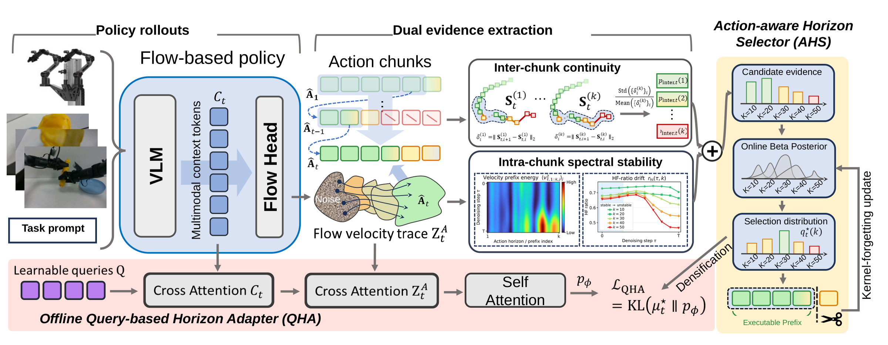

<div align="center">

# ChunkTrust
### Adapting Execution Horizons for Robot Policies with Action-Expert Evidence

**Learning when to observe again, from the policy's own action predictions.**

[](https://arxiv.org/abs/2609.39754)
[](https://hf618.github.io/ChunkTrust.github.io/)
[](https://huggingface.co/Niugan/ChunkTrust)
[](https://github.com/hf618/ChunkTrust/actions/workflows/core.yml)

</div>

<details>
<summary>Authors and affiliations</summary>

**Fanding Huang**¹²\*, **Jingyan Jiang**⁴\*, **Shifeng Bao**³\*, **Mingkang Pu**¹,
**Shiwei Li**⁵, **Jing Xu**⁶, **Shijia Xu**⁷, **Guanbo Huang**¹, **Chenghao Gu**¹,
**Yuzhi Huang**¹, **Chenxin Li**⁸, **Faisal Nadeem Khan**¹, **Huan Yang**²,
**Yan Wang**¹, **Cheng Chi**³†, **Zhi Wang**¹†

¹ Tsinghua University · ² Beijing Academy of Artificial Intelligence ·
³ Renmin University of China · ⁴ Shenzhen Technology University ·
⁵ Hefei University of Technology · ⁶ Jiangnan University ·
⁷ Chongqing University · ⁸ The Chinese University of Hong Kong

\* Equal contribution. † Corresponding authors.

</details>

<div align="center">
  <video src="https://github.com/user-attachments/assets/921168dc-0bb9-48a2-ba1c-035c392da6b7" controls width="100%"></video>
</div>

## 🔥 News

- **2026.09.30:** Our [Project Page](https://hf618.github.io/ChunkTrust.github.io/) is live!

## 🧭 Overview

**Optimal replanning horizons depend on the task phase.** ChunkTrust adapts how many actions a robot commits to from each predicted chunk while keeping the base policy frozen.

<p align="center">
  
</p>

Current action-expert evidence, accumulated episode memory, and a prior learned across episodes contribute to **one horizon decision**. AHS runs without training. Adding QHA supplies a learned prior to the same selector.

## 📖 Abstract

Robot foundation policies predict action chunks, but how many actions to execute before replanning depends on the current task phase. We introduce **ChunkTrust**, which treats the execution horizon as a latent variable inferred from action-expert evidence rather than a fixed hyperparameter. Its training-free *Action-aware Horizon Selector* (AHS) combines intra-chunk spectral stability of generation traces with inter-chunk continuity between executed history and predicted actions. An online Beta posterior with kernel forgetting tracks horizon preferences across replans. A lightweight *Query-based Horizon Adapter* (QHA) optionally learns a context-conditioned dense prior from complementary evidence, fused with current evidence and episode-local Beta memory while the base policy remains frozen. Across RoboTwin2.0 and RoboCasa GR1 Tabletop, AHS improves overall task-averaged success for each evaluated base-policy configuration, including gains of 6.80 percentage points on π0.5 over all 50 RoboTwin2.0 tasks and 9.67 percentage points on Qwen3GR00T in RoboCasa. AHS+QHA raises the gain over Base to 9.44 percentage points on the eight-task π0.5 evaluation. On four real-world household tasks, AHS improves the equal-task mean normalized process score from 50.4% to 57.5%. Ablations examine the contributions of both evidence terms, temporal memory, and the learned prior.

## 🧩 Method

1. **Complementary action-expert evidence.** Intra-chunk generation stability measures how the velocity-prefix spectrum evolves during denoising. Inter-chunk motion continuity checks the boundary between executed history and the predicted prefix. The Fourier transform runs along the action horizon.
2. **Episode-local memory with AHS.** A Beta posterior accumulates horizon preferences across replans. Kernel forgetting lets the decision respond to phase changes. Reset this memory at the start of each episode.
3. **A learned prior with QHA.** A lightweight query head uses frozen policy features to learn dense horizon preferences across episodes from evidence-derived targets.
4. **One execution decision.** Fuse the learned prior, when present, with current evidence and episode memory, choose a prefix, execute it, and observe again. The base action generator remains frozen.

The [integration guide](docs/integration.md) describes traces, action coordinates, selector state and prior fusion.

## 📊 Results

Simulation rows report task-averaged success. The real-robot row reports normalized process score.

| Benchmark | Policy | Task Scope | Train Recipe | Base | ChunkTrust | Method |
| --- | --- | --- | --- | ---: | ---: | --- |
| RoboTwin 2.0 | π0.5 | 50 tasks (full suite) | Multitask post-training | 56.70% | **63.50%** | AHS |
| RoboTwin 2.0 | π0.5 | 8 tasks (subset) | Task-specific post-training | 29.63% | **39.06%** | AHS + QHA |
| RoboCasa GR1 Tabletop | Qwen3GR00T | 24 tasks (full suite) | Multitask post-training | 47.83% | **57.50%** | AHS |
| Real robot | π0.5 | 4 household tasks | Real-robot post-training, 200 demos/task | 50.4% | **57.5%** | AHS |

## 🛠️ Installation

```bash
git clone https://github.com/hf618/ChunkTrust.git
cd ChunkTrust
conda env create -f environment.yml
conda activate chunktrust
python -m pip install -e . --no-build-isolation
```

For selector smoke tests:

```bash
python -m pip install -e '.[test]' --no-build-isolation
python examples/quickstart.py
pytest -q
```

Alternatively, in a Python 3.11 environment:

```bash
python -m pip install -r requirements.txt
```

Policy training and simulation use the [backend environments](docs/backends.md).

## 📦 Data and Checkpoints

Find model weights at [Niugan/ChunkTrust](https://huggingface.co/Niugan/ChunkTrust). Task splits and evaluation manifests are in `configs/`, with recorded results in `results/`.

Training data for the simulation experiments come from [**RoboTwin 2.0**](https://github.com/RoboTwin-Platform/RoboTwin) and [**RoboCasa GR1 Tabletop**](https://github.com/robocasa/robocasa-gr1-tabletop-tasks). The QHA protocols below use RoboTwin 2.0 clean50 demonstrations.

QHA learns horizon preferences from action-expert evidence while the base policy stays frozen.

| Protocol | Policy | Training | Checkpoint |
| --- | --- | --- | --- |
| Eight-task augmentation | π0.5 | Batch 256, 5,000 steps | [Step 5,000](https://huggingface.co/Niugan/ChunkTrust/tree/main/checkpoints/qha_pi05_8task_step5000) |
| Eight-task augmentation | π0 | Batch 256, 5,000 steps | [Step 5,000](https://huggingface.co/Niugan/ChunkTrust/tree/main/checkpoints/qha_pi0_8task_step5000) |
| Six-task training, two held-out tasks | π0.5 | Batch 384, 10,000 steps | [Step 10,000](https://huggingface.co/Niugan/ChunkTrust/tree/main/checkpoints/qha_pi05_heldout6_step10000) |

**Download QHA heads:**

```bash
python scripts/download_asset.py qha_pi05_8task_step5000 --destination checkpoints/qha-pi05-eight/5000
python scripts/download_asset.py qha_pi0_8task_step5000 --destination checkpoints/qha-pi0-eight/5000
python scripts/download_asset.py qha_heldout --destination checkpoints/qha-heldout/10000
```

Each head is loaded alongside its matching frozen base policy. See [training details](docs/training.md) for the eight-task recipe and checkpoint provenance.

## 🏋️ QHA Training

Prepare the π0.5 QHA backend from the repository root, then install its [environment and training data](docs/training.md):

```bash
export CHUNKTRUST_ROOT="$PWD"
python scripts/prepare_backend.py robotwin --heldout --destination workspaces/robotwin-qha
export ROBOTWIN_ROOT="$CHUNKTRUST_ROOT/workspaces/robotwin-qha"
```

**Eight-task training:**

```bash
bash "$CHUNKTRUST_ROOT/scripts/train_qha_eight_task.sh" --exp-name qha-eight-task
```

**Six-task training with two held-out tasks:**

```bash
cd "$ROBOTWIN_ROOT/policy/pi05_horizon"
bash scripts/train_qha_heldout_8gpu.sh --mode formal --exp-name qha-heldout
```

Both launchers accept `--dry-run`. The held-out split trains on Handover Block, Handover Mic, Hanging Mug, Place A2B Left, Place Bread Skillet and Place Can Basket. Blocks Ranking RGB and Place Bread Basket are held out.

## 🧪 Evaluation

Install the [policy environment and simulator assets](docs/backends.md) before running evaluations. Commands below start from the ChunkTrust repository root.

### AHS

Run training-free horizon selection with the frozen π0.5 policy. This RoboTwin 2.0 example uses the **50-task multitask checkpoint at step 30,000**.

```bash
export CHUNKTRUST_ROOT="$PWD"
python scripts/prepare_backend.py robotwin --destination workspaces/robotwin
python scripts/eval_robotwin50.py \
  --task place_a2b_left --setting demo_clean --method ahs \
  --backend-root workspaces/robotwin --output outputs/ahs --gpu 0 --dry-run
```

Place the base checkpoint in the prepared backend's checkpoint directory as described in the [model guide](docs/models.md). Remove `--dry-run` to evaluate. Use `--method base` for the fixed-horizon comparison, and `--setting demo_randomized` for Hard.

### AHS + QHA

Combine AHS with a learned QHA prior while keeping the base policy frozen. This example evaluates **six-task QHA on the held-out Place Bread Basket task**, using the **step-10,000 QHA checkpoint** and the **task-specific, non-qnorm π0.5 base at step 20,000**.

Use the backend prepared in [QHA Training](#-qha-training), and download the head into the evaluator's checkpoint layout:

```bash
export CHUNKTRUST_ROOT="$PWD"
export ROBOTWIN_ROOT="$CHUNKTRUST_ROOT/workspaces/robotwin-qha"
python scripts/download_asset.py qha_heldout \
  --destination "$ROBOTWIN_ROOT/policy/pi05_horizon/checkpoints/pi05_base_aloha_robotwin_full_qha_heldout/qha_heldout6_formal_20260727_05/10000"

cd "$ROBOTWIN_ROOT/policy/pi05_horizon"
bash scripts/eval_qha_heldout_manifest.sh \
  --method ahs_qha --task place_bread_basket --setting demo_clean \
  --manifest "$CHUNKTRUST_ROOT/configs/qha_heldout/manifests/place_bread_basket_demo_clean_100.json" \
  --qha-model qha_heldout6_formal_20260727_05 --qha-step 10000 \
  --base-model pi05_place_bread_basket_clean50 --base-step 20000 \
  --result-root "$CHUNKTRUST_ROOT/outputs/ahs-qha" --gpu 0 --dry-run
```

Place the matching base under `policy/pi05_horizon/checkpoints/pi05_base_aloha_robotwin_full/pi05_place_bread_basket_clean50/20000/`. Remove `--dry-run` to run the 100-episode manifest. Use `--method ahs_only` for AHS on the same task, base checkpoint and episode seeds. For Hard, change both `--setting` and the manifest filename to `demo_randomized`.

**Recorded results:** recompute the released outcome summaries from the repository root:

```bash
python scripts/summarize_results.py --output outputs/recomputed_summary.json
```

See the [evaluation guide](docs/evaluation.md) for RoboCasa GR1 Tabletop and RTC latency evaluations.

## 🗂️ Repository Structure

```text
src/chunktrust/  AHS, learned-prior fusion and backend selectors
examples/       Minimal API example and recorded decision replay
configs/        Frozen task, seed and protocol manifests
scripts/        Backend setup, model download, training smoke checks and evaluation
third_party/    Pinned upstreams, source overlays, provenance and licenses
environments/   Backend environment specifications
results/        Recorded outcomes, source hashes and recomputed summaries
tests/          Numerical equivalence, reset and resume checks
docs/           Training, evaluation, integration and reproduction status
```

## 📝 Citation

```bibtex
@misc{huang2026chunktrust,
  title={ChunkTrust: Adapting Execution Horizons for Robot Policies with Action-Expert Evidence},
  author={Huang, Fanding and Jiang, Jingyan and Bao, Shifeng and Pu, Mingkang and Li, Shiwei and Xu, Jing and Xu, Shijia and Huang, Guanbo and Gu, Chenghao and Huang, Yuzhi and Li, Chenxin and Khan, Faisal Nadeem and Yang, Huan and Wang, Yan and Chi, Cheng and Wang, Zhi},
  year={2026},
  eprint={2609.39754},
  archivePrefix={arXiv},
  primaryClass={cs.RO},
  url={https://arxiv.org/abs/2609.39754}
}
```

## 🙏 Acknowledgements

Built on [OpenPI](https://github.com/Physical-Intelligence/openpi), [RoboTwin](https://github.com/RoboTwin-Platform/RoboTwin), [RoboCasa](https://github.com/robocasa/robocasa), [Isaac-GR00T](https://github.com/NVIDIA/Isaac-GR00T), [StarVLA](https://github.com/starVLA/starVLA) and [X-VLA](https://github.com/2toinf/X-VLA). Please cite the corresponding upstream projects when using their models or benchmarks.

Original ChunkTrust code uses the repository's MIT license. Upstream and adapted files retain their applicable licenses and attribution, listed in [third-party notices](third_party/NOTICE.md). Model and dataset terms are separate from the code license.
