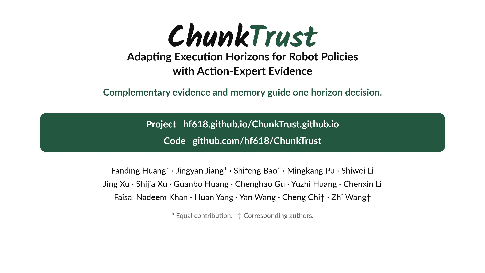

<div align="center">

# ChunkTrust
### Adapting Execution Horizons for Robot Policies with Action-Expert Evidence

**Learning when to observe again, from the policy's own action predictions.**

[](https://hf618.github.io/ChunkTrust.github.io/assets/paper/ChunkTrust.pdf)
[](https://hf618.github.io/ChunkTrust.github.io/)
[](https://huggingface.co/Niugan/ChunkTrust)
[](https://github.com/hf618/ChunkTrust/actions/workflows/core.yml)

</div>

<details>
<summary>Authors and affiliations</summary>

**Fanding Huang**¹²\*, **Jingyan Jiang**⁴\*, **Shifeng Bao**³\*, **Mingkang Pu**¹,
**Shiwei Li**⁵, **Jing Xu**⁶, **Shijia Xu**⁷, **Guanbo Huang**¹, **Chenghao Gu**¹,
**Yuzhi Huang**¹, **Chenxin Li**⁸, **Faisal Nadeem Khan**¹, **Huan Yang**²,
**Yan Wang**¹, **Cheng Chi**³†, **Zhi Wang**¹†

¹ Tsinghua University · ² Beijing Academy of Artificial Intelligence ·
³ Renmin University of China · ⁴ Shenzhen Technology University ·
⁵ Hefei University of Technology · ⁶ Jiangnan University ·
⁷ Chongqing University · ⁸ The Chinese University of Hong Kong

\* Equal contribution. † Corresponding authors.

</details>

<div align="center">
  <a href="https://github.com/hf618/ChunkTrust/releases/tag/media-v1"></a>
  <p><b>Complete project video · 4K · 2 min 57 s · English narration and captions</b></p>
  <p><a href="https://github.com/hf618/ChunkTrust/releases/tag/media-v1">Download the original 4K video on GitHub</a></p>
</div>

## 🔥 News

- **2026.09.30:** Released the core selectors, backend source integrations, training and evaluation recipes, and recorded outcomes. See the [reproduction status](docs/reproducibility.md) for verified checks and remaining dependencies.
- **2026.09.30:** The [project page](https://hf618.github.io/ChunkTrust.github.io/) and complete [4K introduction](https://github.com/hf618/ChunkTrust/releases/tag/media-v1) are available.

## 🧭 Overview

**Optimal replanning horizons depend on the task phase.** ChunkTrust adapts how many actions a robot commits to from each predicted chunk while keeping the base policy frozen.

<p align="center">
  
</p>

Current action-expert evidence, accumulated episode memory, and a prior learned across episodes contribute to **one horizon decision**. AHS runs without training. Adding QHA supplies a learned prior to the same selector.

## 📖 Abstract

Robot foundation policies predict action chunks, but how many actions to execute before replanning depends on the current task phase. We introduce **ChunkTrust**, which treats the execution horizon as a latent variable inferred from action-expert evidence rather than a fixed hyperparameter. Its training-free *Action-aware Horizon Selector* (AHS) combines intra-chunk spectral stability of generation traces with inter-chunk continuity between executed history and predicted actions. An online Beta posterior with kernel forgetting tracks horizon preferences across replans. A lightweight *Query-based Horizon Adapter* (QHA) optionally learns a context-conditioned dense prior from complementary evidence, fused with current evidence and episode-local Beta memory while the base policy remains frozen. Across RoboTwin2.0 and RoboCasa GR1 Tabletop, AHS improves overall task-averaged success for each evaluated base-policy configuration, including gains of 6.80 percentage points on π0.5 over all 50 RoboTwin2.0 tasks and 9.67 percentage points on Qwen3GR00T in RoboCasa. AHS+QHA raises the gain over Base to 9.44 percentage points on the eight-task π0.5 evaluation. On four real-world household tasks, AHS improves the equal-task mean normalized process score from 50.4% to 57.5%. Ablations examine the contributions of both evidence terms, temporal memory, and the learned prior.

## 🧩 Method

1. **Complementary action-expert evidence.** Intra-chunk generation stability measures how the velocity-prefix spectrum evolves during denoising. Inter-chunk motion continuity checks the boundary between executed history and the predicted prefix. The Fourier transform runs along the action horizon.
2. **Episode-local memory with AHS.** A Beta posterior accumulates horizon preferences across replans. Kernel forgetting lets the decision respond to phase changes. Reset this memory at the start of each episode.
3. **A learned prior with QHA.** A lightweight query head uses frozen policy features to learn dense horizon preferences across episodes from evidence-derived targets.
4. **One execution decision.** Fuse the learned prior, when present, with current evidence and episode memory, choose a prefix, execute it, and observe again. The base action generator remains frozen.

The [integration guide](docs/integration.md) describes traces, action coordinates, selector state and prior fusion.

## 📊 Results

Selected results from the [paper](https://hf618.github.io/ChunkTrust.github.io/assets/paper/ChunkTrust.pdf). Simulation rows report task-averaged success. The real-robot row reports normalized process score.

| Benchmark | Policy | Scope | Base | ChunkTrust | Method |
| --- | --- | --- | ---: | ---: | --- |
| RoboTwin2.0 | π0.5 | 50 tasks | 56.70% | **63.50%** | AHS |
| RoboTwin2.0 | π0.5 | 8 tasks | 29.63% | **39.06%** | AHS + QHA |
| RoboCasa GR1 Tabletop | Qwen3GR00T | 24 tasks | 47.83% | **57.50%** | AHS |
| Real robot | π0.5 | 4 household tasks | 50.4% | **57.5%** | AHS |

The 50-task and eight-task RoboTwin evaluations use different checkpoint regimes. Full protocols and per-task outcomes are in the paper.

This release includes **17,200 recorded episode outcomes** and scripts for recomputing the available aggregates. The RoboTwin-50 figures above match the released cohort. Two other located cohorts differ from the paper: RoboCasa π0.5 Base is 42.08% in the records versus 40.08% in the paper, and held-out AHS+QHA is 41.25% versus 42.75%. The eight-task QHA checkpoint-to-result mapping also remains unresolved. Details and original outcomes are retained in the [reproduction audit](docs/reproducibility.md).

## 🛠️ Installation

The standalone selector requires **Python 3.11 and NumPy**, without a GPU or simulator.

```bash
git clone https://github.com/hf618/ChunkTrust.git
cd ChunkTrust
python3.11 -m venv .venv
source .venv/bin/activate
pip install -e '.[test]'
python examples/quickstart.py
python examples/replay_recorded_decisions.py
pytest -q
```

The quickstart uses synthetic inputs. The replay checks **23 recorded real-robot horizon decisions**. Neither estimates task success rates.

```python
from chunktrust import AHS, AHSConfig

selector = AHS(AHSConfig(horizon=50, candidates=(10, 20, 30, 40, 50)), seed=0)
k, evidence = selector.select(velocity, predicted_actions, executed_history)
# Execute at most the first k actions, then acquire the next observation.
# Reset for each new episode. Preserve selector state when resuming.
```

`velocity` has shape `[denoising_steps, horizon, action_dim]`. Predicted actions and executed history must use the same coordinates.

Policy and simulator environments are separate from the core installation:

| Integration | Included implementation | Setup |
| --- | --- | --- |
| RoboTwin π0 and π0.5 | AHS, QHA, generation traces and evaluation hooks | [Backends](docs/backends.md) |
| RoboCasa π0.5 | GR1 observation/action adapter and runtime | [Models](docs/models.md) |
| GR00T N1.5 and N1.6 | Model and simulation integrations | [Backends](docs/backends.md) |
| Qwen3GR00T | StarVLA RoboCasa interface and AHS | [Backends](docs/backends.md) |
| X-VLA | RoboTwin horizon client | [Backends](docs/backends.md) |
| RTC + AHS | Controlled latency runtimes for Easy and Hard | [Evaluation](docs/evaluation.md#latency-and-rtc) |
| Real robot | Recorded decision replay and interface contract | [Real robot](docs/real_robot.md) |

Upstreams are pinned to commits and source overlays retain backend-specific behavior. Fresh rollout checks and outstanding dependencies are recorded in [verification.json](docs/verification.json).

## 📦 Data and Checkpoints

Model weights are hosted at [Niugan/ChunkTrust](https://huggingface.co/Niugan/ChunkTrust). The [asset catalog](configs/assets.json) pins immutable revisions and per-file SHA-256 checksums.

```bash
python scripts/download_asset.py qha_heldout --destination checkpoints/qha-heldout/10000
```

| Artifact | Availability |
| --- | --- |
| π0.5 held-out-six-task QHA head, step 10000 | Published with configuration assets |
| RoboTwin multitask and task-specific base checkpoints | Uploads in progress, see the [model guide](docs/models.md) |
| Evaluation manifests and selected traces | Included under `configs/`, `results/` and `examples/` |
| Full demonstrations and preprocessed teacher caches | Separate dependencies, see [training](docs/training.md) |

A QHA head requires its matching base policy and normalization assets. Partial uploads are not marked as usable checkpoints. The **4K video is hosted on [GitHub Releases](https://github.com/hf618/ChunkTrust/releases/tag/media-v1)**.

## 🏋️ QHA Training

QHA learns horizon preferences while the action generator stays frozen. Its targets come from complementary action-expert evidence.

Prepare the identified six-task training and two-task held-out protocol:

```bash
export CHUNKTRUST_ROOT="$PWD"
python scripts/prepare_backend.py robotwin --heldout --destination workspaces/robotwin-heldout
export ROBOTWIN_ROOT="$CHUNKTRUST_ROOT/workspaces/robotwin-heldout"
cd "$ROBOTWIN_ROOT/policy/pi05_horizon"
bash scripts/train_qha_heldout_8gpu.sh --mode smoke --exp-name qha-smoke --dry-run
```

After installing the backend environment and preparing the datasets, caches and teacher checkpoints, launch the registered recipe:

```bash
bash scripts/train_qha_heldout_8gpu.sh --mode formal --exp-name qha-heldout-reproduction
```

This recipe uses two student GPUs and six teacher GPUs, batch 384, and 10,000 steps. It is distinct from the eight-task augmentation recipe. See [training details](docs/training.md) for the task split, teacher normalization and unresolved material dependencies.

## 🧪 Evaluation

Recompute the released outcomes from the repository root:

```bash
python scripts/summarize_results.py --output outputs/recomputed_summary.json
```

Inspect an archived RoboTwin-50 evaluation command:

```bash
python scripts/prepare_backend.py robotwin --destination workspaces/robotwin
python scripts/eval_robotwin50.py --task place_a2b_left --setting demo_clean \
  --method ahs --backend-root workspaces/robotwin --output outputs/robotwin50 --dry-run
```

Remove `--dry-run` after setting up the backend, simulation assets and matching checkpoints. Full-suite source equivalence and the 36 missing archived cell commands remain open audit items.

The [evaluation guide](docs/evaluation.md) also covers held-out QHA, RoboCasa GR1, and the RTC panels with four tasks, four methods, three delays and 100 episodes per cell in both Easy and Hard. Latency reports include success rate, waiting time, policy calls, inference time and mean observation age.

## 🗂️ Repository Structure

```text
src/chunktrust/  AHS, learned-prior fusion and backend selectors
examples/       Minimal API example and recorded decision replay
configs/        Frozen task, seed and protocol manifests
scripts/        Backend setup, model download, training smoke checks and evaluation
third_party/    Pinned upstreams, source overlays, provenance and licenses
environments/   Backend environment specifications
results/        Recorded outcomes, source hashes and recomputed summaries
tests/          Numerical equivalence, reset and resume checks
docs/           Training, evaluation, integration and reproduction status
```

## 📝 Citation

```bibtex
@misc{huang2026chunktrust,
  title={ChunkTrust: Adapting Execution Horizons for Robot Policies with Action-Expert Evidence},
  author={Huang, Fanding and Jiang, Jingyan and Bao, Shifeng and Pu, Mingkang and Li, Shiwei and Xu, Jing and Xu, Shijia and Huang, Guanbo and Gu, Chenghao and Huang, Yuzhi and Li, Chenxin and Khan, Faisal Nadeem and Yang, Huan and Wang, Yan and Chi, Cheng and Wang, Zhi},
  year={2026},
  url={https://hf618.github.io/ChunkTrust.github.io/}
}
```

## 🙏 Acknowledgements

Built on OpenPI, RoboTwin, RoboCasa, Isaac-GR00T, StarVLA and X-VLA. Please cite the corresponding upstream projects when using their models or benchmarks.

Original ChunkTrust code uses the repository's MIT license. Upstream and adapted files retain their applicable licenses and attribution, listed in [third-party notices](third_party/NOTICE.md). Model and dataset terms are separate from the code license.
